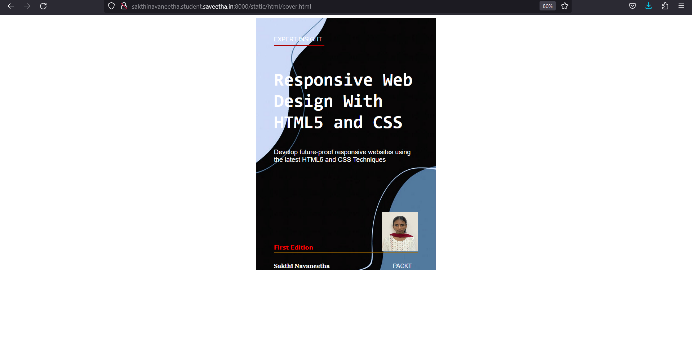

# Book CoverPage Design

## AIM:
To design a static web site for a book cover page.

### Step 1:
Create a new project and a app for your project. Create templates for your web application to display image. 

### Step 2:
Now write the appropiate html code and css code.

### Step 3:
Provide proper margins and padding to display it in proper way.

### Step 4:
Then create appropiate views for your templates and provide the urls for them in urls.py.Now run the server to use your web application and see the result.

## PROGRAM :
<!DOCTYPE html>
<html lang="en">
    <head>
         <meta name="viewport" 
         content="width=device-width, initial-scale=1.0">
         
        <title>Book Cover Page</title>
    </head>
    <body>
        

            

                EXPERT INSIGHT
            

            

                

            

            

                <h1>Responsive Web Design With HTML5 and CSS</h1>

            

                Develop future-proof responsive websites using the latest HTML5 and CSS Techniques
            

            

                
            

            

                

            

            

               
<b>Sakthi Navaneetha</b>

            

            

                PACKT
            

            

                <b>First Edition</b>
            

            
        

    </body>
</html>

## OUTPUT:

## Result:
Thus a book cover has been successfully created using HTML and CSS.

